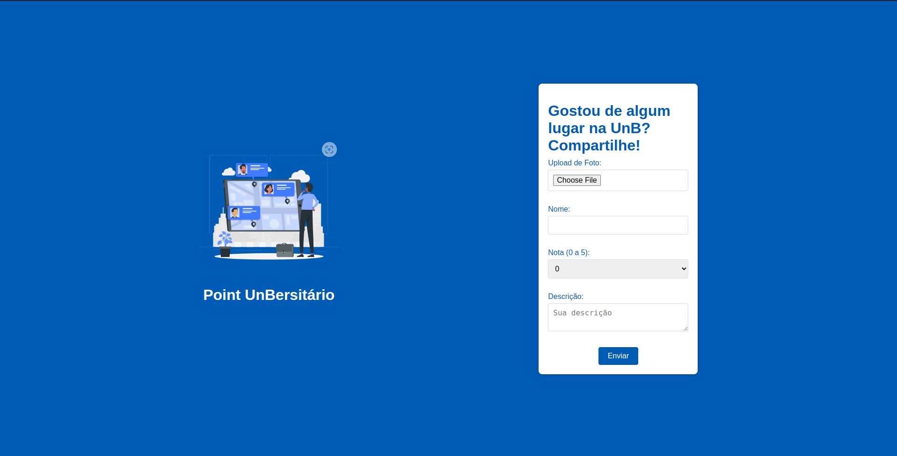

# Projeto ED - Turma 7 - Profa Geovanna - Point UnBersitário
    - O point UnBersitário foi criado após a percepção de que muitos alunos se formam sem realmente conhecer a UnB e todos os seus pontos. O app une em um só lugar a experiência e a visão dos alunos sobre os lugares que já visitaram.


### Autores:

- Arthus César Dias Fernandes | 231006103
- Daniel Filipe Silva Miguel | 231006112
- Yuri Arruda Andrade da Silva | 231006210


## Contexto de Aplicação

- A estrutura de dados escolhida foi a de Lista Duplamente Encadeada com comportamento de Fila. O app assim que o servidor é iniciado faz uma única requisição para o banco de dados (Obs.: Para simplificar a complexidade do WebApp, utilizamos arquivos CSV para simular um banco de dados real), cria e popula as instâncias da Lista Duplamente Encadeada, assim todas as operações são feitas com os dados guardados em memória, por exemplo, os lugares renderizados na tela de feed são resgatados da fila através do método de travessia que retorna um array com todos os lugares cadastrados. Assim como, a autenticação de usuário também é feita através de métodos utilizando a fila duplamente encadeada.

- Na criação de posts utilizamos o método de inserir no final e ordenar, assim que o usuário cria uma publicação o app insere na lista essa publicação em formato de objeto e ordena após a inserção com base no campo de "nota" que está presente no valor daquele objeto que foi inserido.

- Na remoção, criamos um método para mover o item a ser removido para o início e assim utilizar o método de remoção no início respeitando o comportamento de fila que a lista deve ter.

- Criamos uma "feature" na aplicação que filtra os lugares a partir da nota que o usuário escolher, esse recurso utiliza o método de busca binária para retornar todos os itens que correspondem a nota colocada pela pessoa usuária.


## Estruturas de Dados Utilizadas

-> Lista Duplamente Encadeada com comportamento de fila

- A estrutura é essencial para gerenciar os dados que os usuários inserem e a forma como os dados são trabalhados.
## Instruções de Execução

- Para rodar o projeto é preciso:

    ```
    Node: v21.2.0
    ```

- Clonando o repositório (linux):

    ```
    git clone https://github.com/DanFilipe2000/point-unb.git

    cd point-unb

    npm install

    node app.js
    ```
    
- Após o procedimento abra seu navegador e acesse o http://localhost:3000/
## Instruções de Uso

- A primeira tela do app é a tela de login, nela você poderá:

    - Entrar numa conta, caso já tenha.
    - Ir para a página de registro.
    - Ou acessar o feed deslogado.


- Na tela de registro você poderá criar sua conta

    - Colocando seu nome
    - Seu Email
    - Sua Senha


- Depois do login ou registro, você será direcionado para a tela de feed onde poderá ver todos os lugares já postados ordenados por nota, a nota deles e uma breve descrição dos lugares. Nessa tela você poderá também filtrar os lugares a partir da nota deles.


- No canto superior direito terá três alternativas, "Criar Post", "Perfil" e "Sair"

- "Criar Post" te redirecionará para um formulário de criação de post onde você poderá cadastrar um lugar, colocando uma foto, o nome do local, uma nota e uma descrição. Após a submissão você irá para a tela de feed onde poderá ver o lugar recém cadastrado.



- "Perfil", te redirecionará para a tela onde mostrará suas informações e as publicações que você já fez, sendo possível remover uma publicação.


- "Sair", te deslogará da sua conta e te redirecionará para a tela de login novamente.
## Referências

[Curso de Node.JS - Vitor Lima](https://www.youtube.com/watch?v=LLqq6FemMNQ&list=PLJ_KhUnlXUPtbtLwaxxUxHqvcNQndmI4B)
[Lista Duplamente Encadeada - Thiago Jabur](https://www.youtube.com/watch?v=wqzUPt6DIwk)
[Busca Binária - Halisson Paz](https://www.youtube.com/watch?v=EgLE5HwRy_M)
